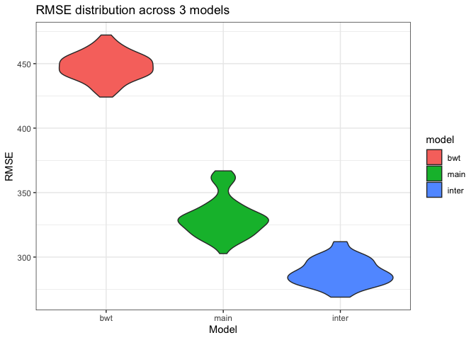

p8105_hw6_zq2209
================
Zining Qi
2022-11-30

# Problem 2

## Loading and cleaning data

``` r
url = "https://raw.githubusercontent.com/washingtonpost/data-homicides/master/homicide-data.csv"
homicide = read_csv(url) %>% 
  janitor::clean_names()
```

    ## Rows: 52179 Columns: 12
    ## ── Column specification ────────────────────────────────────────────────────────
    ## Delimiter: ","
    ## chr (9): uid, victim_last, victim_first, victim_race, victim_age, victim_sex...
    ## dbl (3): reported_date, lat, lon
    ## 
    ## ℹ Use `spec()` to retrieve the full column specification for this data.
    ## ℹ Specify the column types or set `show_col_types = FALSE` to quiet this message.

``` r
homicide$city_state = paste(homicide$city, homicide$state, sep = ', ')
homicide %>%
  head() %>% 
  knitr::kable()
```

| uid        | reported_date | victim_last | victim_first | victim_race | victim_age | victim_sex | city        | state |      lat |       lon | disposition           | city_state      |
|:-----------|--------------:|:------------|:-------------|:------------|:-----------|:-----------|:------------|:------|---------:|----------:|:----------------------|:----------------|
| Alb-000001 |      20100504 | GARCIA      | JUAN         | Hispanic    | 78         | Male       | Albuquerque | NM    | 35.09579 | -106.5386 | Closed without arrest | Albuquerque, NM |
| Alb-000002 |      20100216 | MONTOYA     | CAMERON      | Hispanic    | 17         | Male       | Albuquerque | NM    | 35.05681 | -106.7153 | Closed by arrest      | Albuquerque, NM |
| Alb-000003 |      20100601 | SATTERFIELD | VIVIANA      | White       | 15         | Female     | Albuquerque | NM    | 35.08609 | -106.6956 | Closed without arrest | Albuquerque, NM |
| Alb-000004 |      20100101 | MENDIOLA    | CARLOS       | Hispanic    | 32         | Male       | Albuquerque | NM    | 35.07849 | -106.5561 | Closed by arrest      | Albuquerque, NM |
| Alb-000005 |      20100102 | MULA        | VIVIAN       | White       | 72         | Female     | Albuquerque | NM    | 35.13036 | -106.5810 | Closed without arrest | Albuquerque, NM |
| Alb-000006 |      20100126 | BOOK        | GERALDINE    | White       | 91         | Female     | Albuquerque | NM    | 35.15111 | -106.5378 | Open/No arrest        | Albuquerque, NM |

## Filtering data

``` r
homicide_df = homicide %>% 
  filter(!(city_state %in% c("Dallas, TX", "Phoenix, AZ", "Kansas City, MO", "Tulsa, AL" ))) %>% 
  filter(victim_race %in% c("White", "Black"))
```

``` r
homicide_df = homicide_df %>% 
  mutate(victim_age = ifelse(victim_age == "Unknown", NA, victim_age))
```

``` r
homicide_df = homicide_df %>% 
  mutate(victim_age = strtoi(victim_age))
```

## Logistics regression for Baltimore, MD

``` r
homicide_data = homicide_df %>% 
  mutate(solved_or_not = ifelse(disposition == "Closed by arrest", 1, 0))
```

``` r
glm_baltimore = homicide_data %>% 
  filter(city_state == "Baltimore, MD") %>% 
  glm(solved_or_not ~ victim_sex + victim_race + victim_age, family = binomial, data = .)

summary(glm_baltimore)
```

    ## 
    ## Call:
    ## glm(formula = solved_or_not ~ victim_sex + victim_race + victim_age, 
    ##     family = binomial, data = .)
    ## 
    ## Deviance Residuals: 
    ##     Min       1Q   Median       3Q      Max  
    ## -1.6223  -0.8958  -0.8688   1.4699   1.6579  
    ## 
    ## Coefficients:
    ##                   Estimate Std. Error z value Pr(>|z|)    
    ## (Intercept)       0.309981   0.171295   1.810   0.0704 .  
    ## victim_sexMale   -0.854463   0.138176  -6.184 6.26e-10 ***
    ## victim_raceWhite  0.841756   0.174716   4.818 1.45e-06 ***
    ## victim_age       -0.006727   0.003324  -2.024   0.0430 *  
    ## ---
    ## Signif. codes:  0 '***' 0.001 '**' 0.01 '*' 0.05 '.' 0.1 ' ' 1
    ## 
    ## (Dispersion parameter for binomial family taken to be 1)
    ## 
    ##     Null deviance: 3567.9  on 2752  degrees of freedom
    ## Residual deviance: 3492.7  on 2749  degrees of freedom
    ## AIC: 3500.7
    ## 
    ## Number of Fisher Scoring iterations: 4

``` r
save(glm_baltimore, file = "result/glm_baltimore_result.RData")
```

### Odds ratio and confidence interval of odds ratio

``` r
glm_baltimore_table = broom::tidy(glm_baltimore) %>% 
  mutate(or = exp(estimate), 
         or_lower = exp(estimate - 1.96*std.error), 
         or_upper = exp(estimate + 1.96*std.error)) %>% 
  filter(term == "victim_sexMale") %>% 
  select(or, or_lower, or_upper) %>% 
  rename("Odds ratio" = or, 
         "Lower bound" = or_lower, 
         "Upper bound" = or_upper) %>% 
  knitr::kable(digits = 3)

glm_baltimore_table
```

| Odds ratio | Lower bound | Upper bound |
|-----------:|------------:|------------:|
|      0.426 |       0.325 |       0.558 |

The odds ratio for solving homicides comparing male victims to female
victims keeping all other variables fixed in Baltimore is 0.426, and 95%
confidence interval is (0.325, 0.558).

## Odds ratio and confidence interval for all cities

``` r
glm_all = function(citystate){
  city_glm = homicide_data %>% 
    filter(city_state == citystate) %>% 
    glm(solved_or_not ~ victim_sex + victim_race + victim_age, family = binomial, data = .) %>% 
    broom::tidy() %>% 
    mutate(or = exp(estimate), 
         or_lower = exp(estimate - 1.96*std.error), 
         or_upper = exp(estimate + 1.96*std.error)) %>% 
    filter(term == "victim_sexMale") %>% 
    select(or, or_lower, or_upper)
    
    city_glm
}
```

``` r
city_state_list = homicide_data %>% 
  select(city_state) %>% 
  unique()
```

``` r
glm_all_result = city_state_list %>% 
  mutate(glm_result = map(city_state, glm_all)) %>% 
  unnest(glm_result) %>% 
  arrange(desc(or))
```

### Table of odds ratio for all cities

``` r
glm_all_table = glm_all_result %>% 
  rename("Odds ratio" = or, 
         "Lower bound" = or_lower, 
         "Upper bound" = or_upper) %>% 
  knitr::kable(digits = 3)

glm_all_table
```

| city_state         | Odds ratio | Lower bound | Upper bound |
|:-------------------|-----------:|------------:|------------:|
| Albuquerque, NM    |      1.767 |       0.831 |       3.761 |
| Stockton, CA       |      1.352 |       0.621 |       2.942 |
| Fresno, CA         |      1.335 |       0.580 |       3.071 |
| Nashville, TN      |      1.034 |       0.685 |       1.562 |
| Richmond, VA       |      1.006 |       0.498 |       2.033 |
| Atlanta, GA        |      1.000 |       0.684 |       1.463 |
| Tulsa, OK          |      0.976 |       0.614 |       1.552 |
| Oklahoma City, OK  |      0.974 |       0.624 |       1.520 |
| Minneapolis, MN    |      0.947 |       0.478 |       1.875 |
| Indianapolis, IN   |      0.919 |       0.679 |       1.242 |
| Charlotte, NC      |      0.884 |       0.557 |       1.403 |
| Birmingham, AL     |      0.870 |       0.574 |       1.318 |
| Savannah, GA       |      0.867 |       0.422 |       1.780 |
| Las Vegas, NV      |      0.837 |       0.608 |       1.154 |
| Durham, NC         |      0.812 |       0.392 |       1.683 |
| Tampa, FL          |      0.808 |       0.348 |       1.876 |
| Milwaukee, wI      |      0.727 |       0.499 |       1.060 |
| Memphis, TN        |      0.723 |       0.529 |       0.988 |
| Jacksonville, FL   |      0.720 |       0.537 |       0.966 |
| Houston, TX        |      0.711 |       0.558 |       0.907 |
| San Antonio, TX    |      0.705 |       0.398 |       1.249 |
| St. Louis, MO      |      0.703 |       0.530 |       0.932 |
| Washington, DC     |      0.690 |       0.468 |       1.017 |
| Boston, MA         |      0.674 |       0.356 |       1.276 |
| Fort Worth, TX     |      0.669 |       0.397 |       1.127 |
| Sacramento, CA     |      0.669 |       0.335 |       1.337 |
| Los Angeles, CA    |      0.662 |       0.458 |       0.956 |
| San Francisco, CA  |      0.608 |       0.317 |       1.165 |
| New Orleans, LA    |      0.585 |       0.422 |       0.811 |
| Detroit, MI        |      0.582 |       0.462 |       0.734 |
| Oakland, CA        |      0.563 |       0.365 |       0.868 |
| Columbus, OH       |      0.532 |       0.378 |       0.750 |
| Buffalo, NY        |      0.521 |       0.290 |       0.935 |
| Miami, FL          |      0.515 |       0.304 |       0.872 |
| San Bernardino, CA |      0.500 |       0.171 |       1.462 |
| Philadelphia, PA   |      0.496 |       0.378 |       0.652 |
| Louisville, KY     |      0.491 |       0.305 |       0.790 |
| Denver, CO         |      0.479 |       0.236 |       0.971 |
| Pittsburgh, PA     |      0.431 |       0.265 |       0.700 |
| Baltimore, MD      |      0.426 |       0.325 |       0.558 |
| San Diego, CA      |      0.413 |       0.200 |       0.855 |
| Long Beach, CA     |      0.410 |       0.156 |       1.082 |
| Chicago, IL        |      0.410 |       0.336 |       0.501 |
| Cincinnati, OH     |      0.400 |       0.236 |       0.677 |
| Omaha, NE          |      0.382 |       0.203 |       0.721 |
| Baton Rouge, LA    |      0.381 |       0.209 |       0.695 |
| New York, NY       |      0.262 |       0.138 |       0.499 |

### Graph that show the odds ratio and confidence interval for all cities

``` r
glm_all_result %>% 
  mutate(city_state = fct_reorder(city_state, or)) %>% 
  ggplot(aes(x = city_state, y = or)) + 
  geom_point(color = "red") + 
  geom_errorbar(aes(ymin = or_lower, ymax = or_upper)) + 
  coord_flip() + 
  labs(title = "Odds Ratio of solving cases comparing male victims to female victims", 
       y = "Odds ratio of solving cases", 
       x = "City, State", 
       caption = "Bars represent 95% confidence interval") + 
  theme_classic() 
```

<!-- -->

From the plot of odds ratio and confidence interval, Albuquerque has the
largest odds ratio(larger than 1) and confidence interval, while New
York has the smallest(smaller than 1). Confidence interval that doesn’t
include 1 implies 95% confidence that there is a difference for solving
homicides comparing male victims to female victims. The smaller the odds
ratio, the largest differences in solving homicides comparing male
victims to female victims.

# Problem 3

## LOading and cleaning data

``` r
birthweight = read_csv("./data/birthweight.csv") %>% 
  janitor::clean_names()
```

    ## Rows: 4342 Columns: 20
    ## ── Column specification ────────────────────────────────────────────────────────
    ## Delimiter: ","
    ## dbl (20): babysex, bhead, blength, bwt, delwt, fincome, frace, gaweeks, malf...
    ## 
    ## ℹ Use `spec()` to retrieve the full column specification for this data.
    ## ℹ Specify the column types or set `show_col_types = FALSE` to quiet this message.

``` r
birthweight = birthweight %>% 
  mutate(babysex = as.factor(babysex), 
         frace = as.factor(frace), 
         malform = as.factor(malform), 
         mrace = as.factor(mrace))
```

### Histogram of birth weight

``` r
birthweight_hist = birthweight %>% 
  ggplot(aes(x = bwt)) + 
  geom_histogram() + 
  labs(x = "Birthweight")

birthweight_hist
```

    ## `stat_bin()` using `bins = 30`. Pick better value with `binwidth`.

<!-- -->

## Propose a model

From the course, Introduction to Public Health, I have learned some
factors that influence birth weight of new born, and read some articles
about the issue. From these information, there are some factors that
affect birth weight a lot. These are biology factor: mothers’ race,
mothers’ health condition, mothers’ age. And there are social and
financial factors, such as income of the family. Basrs on these
information, the predictors that I choose are
`Length of Pregnancy, Mother's birth weight, Age of the parent, race, SES (income)`.
The model would be `bwt ~ gaweeks + mrace + ppbmi + fincome + momage`.

``` r
lm_bwt = lm(bwt ~ gaweeks+mrace+ppbmi+fincome+momage, data = birthweight)
```

### Summary of the model

``` r
lm_bwt %>% broom::tidy()
```

    ## # A tibble: 8 × 5
    ##   term        estimate std.error statistic   p.value
    ##   <chr>          <dbl>     <dbl>     <dbl>     <dbl>
    ## 1 (Intercept)  535.      103.        5.18  2.29e-  7
    ## 2 gaweeks       59.2       2.21     26.8   9.15e-147
    ## 3 mrace2      -240.       16.1     -14.9   5.00e- 49
    ## 4 mrace3       -70.9      70.1      -1.01  3.12e-  1
    ## 5 mrace4      -155.       31.0      -5.01  5.66e-  7
    ## 6 ppbmi         15.8       2.17      7.28  3.90e- 13
    ## 7 fincome        0.558     0.294     1.90  5.74e-  2
    ## 8 momage        -0.238     1.95     -0.122 9.03e-  1

### Residual plot of the model

``` r
birthweight %>% 
  modelr::add_predictions(lm_bwt) %>% 
  modelr::add_residuals(lm_bwt) %>% 
  ggplot(aes(x = pred, y = resid)) +
  geom_point() +
  geom_smooth(se = FALSE, method = "lm", color = "red") +
  labs(
    x = "Predicted Values",
    y = "Residuals",
    title = "Residuals vs. predicted values"
  )
```

    ## `geom_smooth()` using formula 'y ~ x'

<!-- -->

The plot seems okay because the red line is horizontal, and the plot
seems random with predicted values.

## Two other models

``` r
lm_main = lm(bwt ~ gaweeks+blength, data = birthweight)
lm_inter = lm(bwt ~ bhead*blength*babysex, data = birthweight)
```

``` r
lm_main %>% broom::tidy()
```

    ## # A tibble: 3 × 5
    ##   term        estimate std.error statistic  p.value
    ##   <chr>          <dbl>     <dbl>     <dbl>    <dbl>
    ## 1 (Intercept)  -4348.      98.0      -44.4 0       
    ## 2 gaweeks         27.0      1.72      15.7 2.36e-54
    ## 3 blength        129.       1.99      64.6 0

``` r
lm_inter %>% broom::tidy()
```

    ## # A tibble: 8 × 5
    ##   term                    estimate std.error statistic      p.value
    ##   <chr>                      <dbl>     <dbl>     <dbl>        <dbl>
    ## 1 (Intercept)            -7177.     1265.       -5.67  0.0000000149
    ## 2 bhead                    182.       38.1       4.78  0.00000184  
    ## 3 blength                  102.       26.2       3.90  0.0000992   
    ## 4 babysex2                6375.     1678.        3.80  0.000147    
    ## 5 bhead:blength             -0.554     0.780    -0.710 0.478       
    ## 6 bhead:babysex2          -198.       51.1      -3.88  0.000105    
    ## 7 blength:babysex2        -124.       35.1      -3.52  0.000429    
    ## 8 bhead:blength:babysex2     3.88      1.06      3.67  0.000245

## Comparing three models using cross validation

``` r
cv_df = 
  crossv_mc(birthweight, 100)
```

``` r
cv_df = 
  cv_df %>% 
  mutate(
    lm_bwt  = map(train, ~lm(bwt ~ gaweeks+mrace+ppbmi+fincome+momage, data = .x)),
    lm_main  = map(train, ~lm(bwt ~ gaweeks+blength, data = .x)),
    lm_inter  = map(train, ~lm(bwt ~ bhead*blength*babysex, data = .x))) %>% 
  mutate(
    rmse_bwt = map2_dbl(lm_bwt, test, ~rmse(model = .x, data = .y)),
    rmse_main = map2_dbl(lm_main, test, ~rmse(model = .x, data = .y)),
    rmse_inter = map2_dbl(lm_inter, test, ~rmse(model = .x, data = .y)))
```

``` r
cv_df %>% 
  select(starts_with("rmse")) %>% 
  pivot_longer(
    everything(),
    names_to = "model", 
    values_to = "rmse",
    names_prefix = "rmse_") %>% 
  mutate(model = fct_inorder(model)) %>% 
  ggplot(aes(x = model, y = rmse)) + 
  geom_violin(aes(fill = model)) +
  theme_bw() +
  labs(
    x = "Model",
    y = "RMSE",
    title = "RMSE distribution across 3 models"
  )
```

<!-- -->

The three-interaction model seems the best among three models according
to the RMSE distribution for each model. The model with all interaction
term has the smallest prediction error compared to others. So, the model
with interactions are better.
